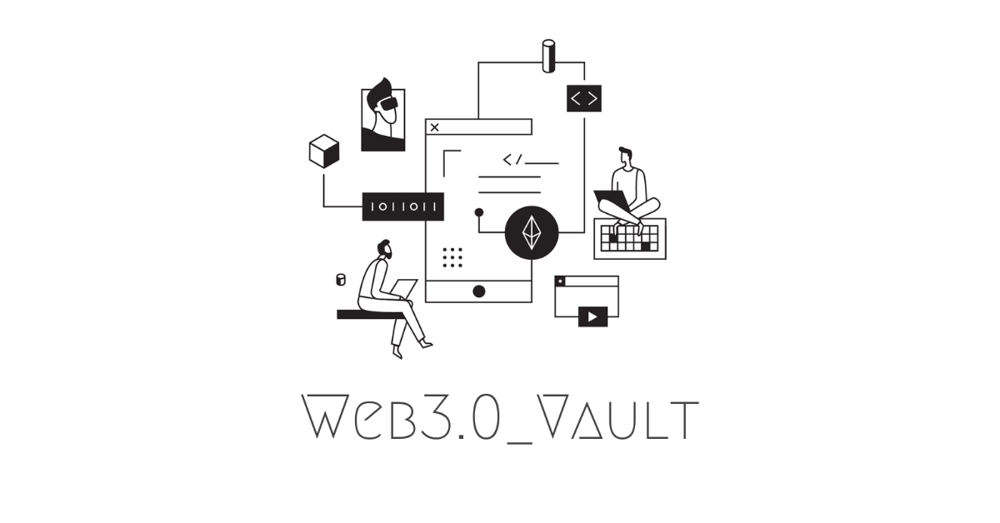

*****

## Introduction and Basics

- Decentralized web - https://blockchainhub.net/web3-decentralized-web/

- https://diode.io/blockchain/Best-Resources-to-Learn-Web3-Blockchain-Decentralized-PKI-and-Ethereum-19262/

- https://web3.career/learn-web3

- https://www.useweb3.xyz/

- https://dev.to/cooper_kunz/educational-resources-for-web-3-0-1jmo

- https://github.com/DavidJohnstonCEO/DecentralizedApplications

- https://www.freecodecamp.org/news/breaking-into-ethereum-crypto-web3-as-a-developer/amp/

- https://moralis.io/the-ultimate-guide-to-web3-what-is-web3/

- https://blog.oliverjumpertz.dev/your-roadmap-to-becoming-a-web-30-developer

- https://ethereum.org/fr/developers/tutorials/set-up-web3js-to-use-ethereum-in-javascript/

- https://vitto.cc/web3-and-solidity-smart-contracts-development-roadmap/

- https://dev.to/pascavld/how-to-get-your-first-job-as-a-developer-web3-2021-developer-roadmap-and-more-4hn1

- https://medium.com/theweb3stack/how-to-get-into-crypto-a-roadmap-for-a-web3-developer-4a5806f61869

- https://gitcoin.co/grants/3150/defi-developer-roadmap

- https://blog.idrisolubisi.com/web-3-a-developer-roadmap-and-resources-to-get-started

- https://rattibha.com/thread/1439980837899055108?lang=en

- https://betterprogramming.pub/transform-into-a-web3-crypto-nft-and-blockchain-development-expert-5-resources-8fdd11037eb8

- https://townhall.hashnode.com/best-web3-resources

- https://dev.to/olanetsoft/web-30-a-developer-roadmap-guide-and-resources-to-get-started-45oa

## Blockchain

- How does Ethereum work, anyway? — how it functions at a technical level, without complex math https://medium.com/@preethikasireddy/how-does-ethereum-work-anyway-22d1df506369

- The Ethereum Yellow Paper https://ethereum.github.io/yellowpaper/paper.pdf

- The idea of smart contracts http://www.fon.hum.uva.nl/rob/Courses/InformationInSpeech/CDROM/Literature/LOTwinterschool2006/szabo.best.vwh.net/idea.html

- Making Sense of “Cryptoeconomics” https://medium.com/l4-media/making-sense-of-cryptoeconomics-5edea77e4e8d

- https://dev.to/abdulmaajid/top-programming-languages-to-create-smart-contracts-3n3f

- https://ethereum.org/en/developers/docs/smart-contracts/languages/

- https://moralis.io/best-languages-for-blockchain-development-full-tutorial/

- https://blog.logrocket.com/ethereum-blockchain-development-using-web3-js/

- https://diode.io/blockchain/Best-Resources-to-Learn-Web3-Blockchain-Decentralized-PKI-and-Ethereum-19262/

- https://github.com/Xel/Blockchain-stuff

## Some cool web3 Github Repo

Info and Documentation

- https://github.com/JoinColony/awesome-web3

- https://github.com/Web3-Melbourne/learning-resources

- https://github.com/jsjoeio/web3-cheatsheet

- https://ethereumjs.github.io/

- https://github.com/miguelmota/ethereum-development-with-go-book

- https://github.com/ethereumbook/ethereumbook

## Libraries, Projects, and tools

- https://github.com/ChainSafe/web3.js

- https://github.com/dappuniversity/web3_examples

- https://github.com/NoahZinsmeister/web3-react

- https://github.com/gochain/web3

- https://github.com/0xProject/tools

- https://github.com/web3rb/your-first-web3-dapp

- https://geth.ethereum.org/docs/dapp/native

- https://github.com/ConsenSys/ethereum-developer-tools-list

- https://github.com/ethereum/remix-ide

## Solidity 

- https://github.com/willitscale/learning-solidity

- https://github.com/smartcontractkit/full-blockchain-solidity-course-py

- https://github.com/paulrberg/solidity-template

- https://github.com/bkrem/awesome-solidity

- https://github.com/bancorprotocol/contracts-solidity

- https://github.com/OpenZeppelin/openzeppelin-contracts

## Rust

- https://github.com/OpenZeppelin/ethernaut 

- https://learn.figment.io/tutorials/write-and-deploy-a-smart-contract-on-near

- http://troubles.md/why-write-smart-contracts-in-rust/

- https://github.com/Concordium/concordium-rust-smart-contracts

- https://medium.com/hackernoon/rust-smart-contracts-demos-challenges-28fc0a48ddd6

- https://github.com/perlin-network/smart-contract-rs

- https://paritytech.github.io/ink-docs/why-rust-for-smart-contracts/

## Decentralized DNS and Networks

- Handshake, ENS and Decentralized Naming Services Explained (2018) https://hackernoon.com/handshake-ens-and-decentralized-naming-services-explained-2e69a1ca1313

- Why DNS-on-Blockchain is the next step after DNS-over-HTTPS — our take on the issue: https://diode.io/distributed-infrastructure/Why-DNS-on-Blockchain-is-the-next-step-after-DNS-over-HTTPS-19231/

- IPFS — introducing a peer-to-peer distributed file system https://ipfs.io/ipfs/QmR7GSQM93Cx5eAg6a6yRzNde1FQv7uL6X1o4k7zrJa3LX/ipfs.draft3.pdf

- Swarm: https://github.com/ethersphere/swarm

- State-of-the-art of decentralized web https://hackernoon.com/a-state-of-the-art-of-decentralized-web-part-2-ea630917332a

- https://towardsdatascience.com/decentralizing-your-website-f5bca765f9ed

- https://decrypt.co/resources/how-to-use-ipfs-the-backbone-of-web3

- https://docs.ipfs.io/

- https://medium.com/pinata/web3-data-portability-through-ipfs-saved-hicetnunc-724e3df2948d

- https://bitsofco.de/setting-up-a-decentralised-website/

## Smart Contracts:

- https://github.com/blockstack/docs

- https://github.com/smartcontractkit

- https://github.com/ConsenSys/smart-contract-best-practices

- https://github.com/TokenMarketNet/smart-contracts

- https://github.com/ethereum/remix

- https://github.com/trufflesuite/truffle

## White Papers:

- https://github.com/xasos/awesome-decentralized-papers

- https://github.com/DavidJohnstonCEO/DecentralizedApplications

- https://github.com/OffcierCia/DeFi-Developer-Road-Map

- https://a16z.com/wp-content/uploads/2021/10/How-to-Win-the-Future-1.pdf

- https://chain.link/whitepaper

- https://github.com/the-dao/whitepaper

- https://whitepaperdatabase.com/category/whitepapers/

## DAOs

- https://ethereum.org/en/dao/

- https://academy.binance.com/en/articles/decentralized-autonomous-organizations-daos-explained

- https://consensys.net/blog/blockchain-explained/what-is-a-dao-and-how-do-they-work/

- https://github.com/the-dao/whitepaper

- https://www.singularitydao.ai/file/2021/04/Platform-Whitepaper-3.pdf

## Some Cool Projects:

- https://github.com/HelloZeroNet/ZeroNet

- https://github.com/mehrdadrad/radvpn

- https://betterprogramming.pub/blockchain-introduction-using-real-world-dapp-react-solidity-web3-js-546471419955

- https://medium.com/ethereum-developers/the-ultimate-end-to-end-tutorial-to-create-and-deploy-a-fully-descentralized-dapp-in-ethereum-18f0cf6d7e0e

- https://www.moesif.com/blog/blockchain/ethereum/Tutorial-for-building-Ethereum-Dapp-with-Integrated-Error-Monitoring/

- https://github.com/erowell/web3-learn

## Tutorials 
- How to create a Smart Contract to mint an NFT : https://dev.to/emanuelferreira/how-to-create-a-smart-contract-to-mint-a-nft-2bbn
- How to create a motherf*cking NFT using Solidity : https://dev.to/abdulrauf11/how-to-create-a-motherfcking-nft-using-solidity-5b5d
- HOW TO WRITE & DEPLOY AN NFT (PART 1/3 OF NFT TUTORIAL SERIES) : https://medium.com/coinmonks/guide-to-creating-your-own-nft-with-javascript-solidity-part-1-of-3-7909b80fae94
